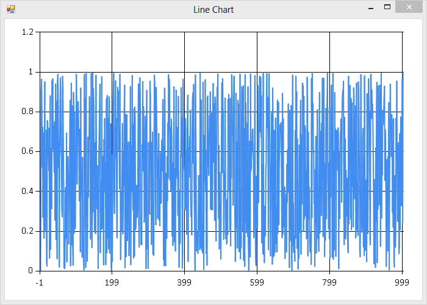

# Playing with Influx from FSI

This little set of scripts allows you to play with an InfluxDB instance form an FSI session, with built in FsEye and FSharp.Charting support.

Unfortunately, this little demo environment is Windows only :(.

Open ``Setup.fsx`` and add the relevant credentials (Influx supply a free playground at http://play.influxdb.org/ if you don't want to download it yourself).

Then fire up a new fsi instance with the something like this:

```
C:\Program Files (x86)\Microsoft SDKs\F#\3.0\Framework\v4.0\Fsi.exe" --load:"<mypathhere>\Setup.fsx
```

## Adding some data

Open the ``Setup`` module:

``` fsharp
open Setup;;
```

We're using a simple .net client which uses Newtonsoft to serialize DTOs to a format that Influx understands. So let's create a simple type, and write it to a time series.

``` fsharp
type MyEvent = { Name : string; Metric : float }
client.Write ("EventStreamName", { Name = "Bob"; Metric = 1.0 });;
```

That should return ``val it : unit = ()`` and you should have a record in your database. FsEye should have also popped up showing you the current state of values in FSI. It will return ``unit`` regardless of whether it succeeds or fails, so that's something to be aware of...

Let's create 1,000 more:

``` fsharp
let rand = System.Random()
let create () = { Name = "Bob"; Metric = rand.NextDouble() }

[ for _ in 1..1000 -> client.Write ("EventStreamName", create()) ];;
```

And then let's get them all back:

``` fsharp
client.Query<MyEvent> "select * from EventStreamName"
|> Async.RunSynchronously;;
```

A ``Choice<seq<Influx.Client.QueryResult<MyEvent>>,Influx.Client.QueryFailure>`` you say? Obviously... (This might be a good moment to say that you can just view results in the Influx admin dashboard as well).

Lets right a quick helper that assumes that the query succeeds, and that the query only returns results from a single time series. Don't do this in production :) .

``` fsharp
let querySingleStream<'T> query =
    client.Query<'T> query
    |> Async.RunSynchronously
    |> function
       | Choice1Of2 r -> Seq.head r
       | Choice2Of2 f -> failwith "Bang";;
```

Finally, let's graph the results:

``` fsharp
open FSharp.Charting
Chart.Line (bobs.Values |> List.mapi (fun i b -> (i, b.Metric)));;
```



Now go, read the [InfluxDB documentation](http://influxdb.org/docs/) and play!
